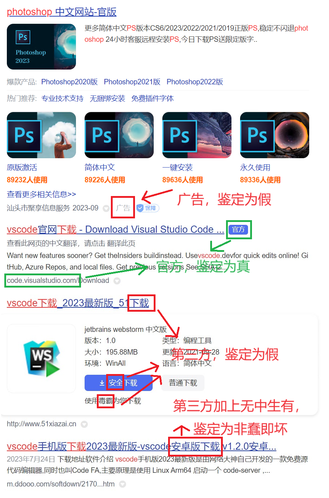
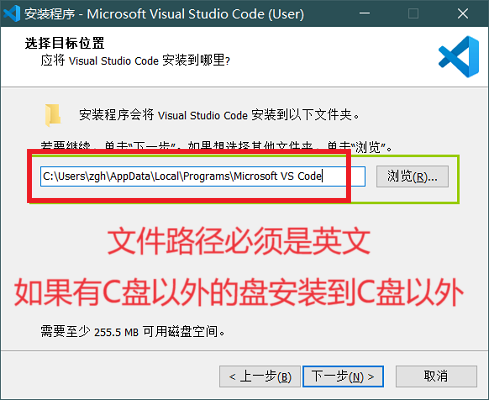
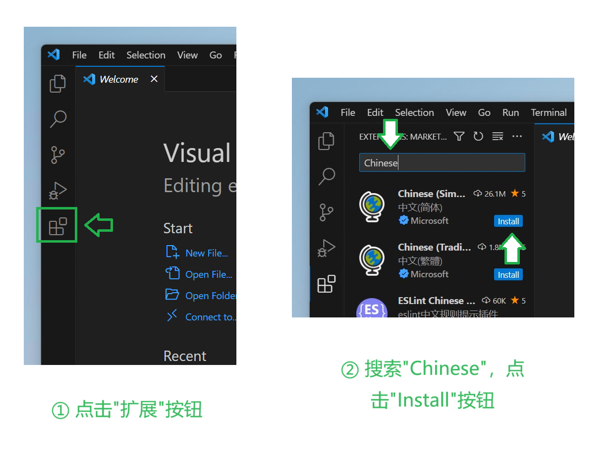
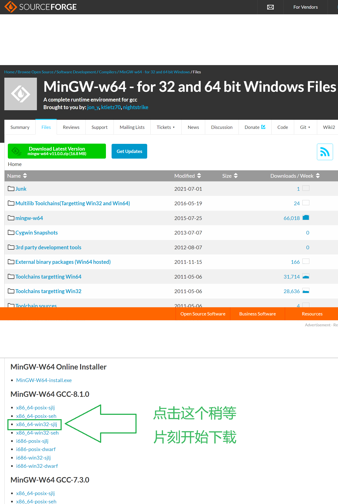
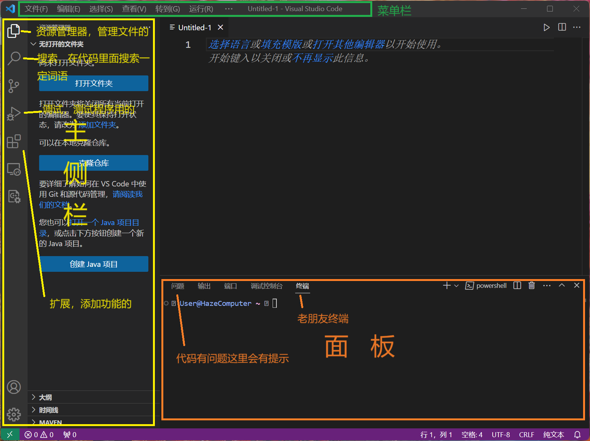
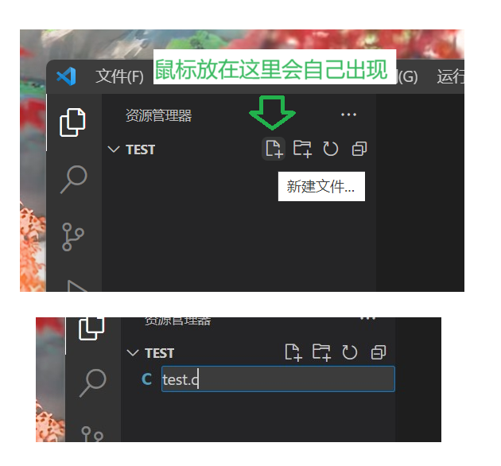
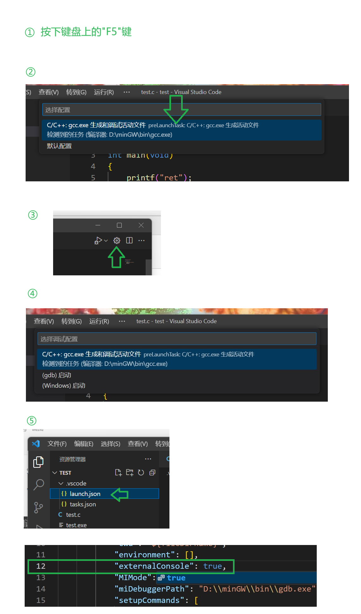

## 第一幕 准备就绪！
### 第一步 安装VSCode
就像打开网页需要浏览器、聊天需要使用微信与QQ一样，要帮助先驱编写程序，我们也要做好相应的准备。接下来，我们将一起完成编程所需软件的安装，顺便学点有趣的东西。我们以`Windows`系统安装`Visual Studio Code (VSCode)`为例进行开发环境的配置。

> [!question]
> **Q：什么是Windows操作系统？我使用的是什么操作系统？**
> 
> A：这个问题你应该去问问搜索引擎（例如百度或谷歌）。
> 
> 独立解决问题是我们程序员十分推崇的一种能力。现在你大概还没有形成这样的能力。不过好在互联网是无所不知的，你的问题大概率别人也遇到过，所以为什么不去问问神奇的互联网呢？也许你会觉得什么问题都在网上搜很不好，那请你收走不必要的担忧，因为互联网就是所有程序员的另一个大脑，这在所有人看来都天经地义。
> 
> 请在百度或谷歌搜索`Windows`、`macOS`，随意地略读一下搜索引擎给出的介绍和图片，这样你通过对比应该就会知道自己的电脑是什么系统了。

&emsp;

> [!question]
> **Q：我怎么知道我的Windows系统是哪个版本？**
> 
> A：你应该搜索`查询Windows版本`获得办法。

&emsp;

> [!question]
> **Q：我的系统不是Windows，我应该怎么办？**
> 
> A：那挺不错。下面的可选任务01对你来说是必选的。使用Windows以外的电脑操作系统很需要独立解决问题的能力。

&emsp;

> [!hw] 
> **可选任务01：自己动手**
> 
> 你可以通过实践让自己更快获得独立解决问题的能力。不阅读本小节的内容，通过搜索引擎搜索“系统具体版本 VSCode C语言环境”尝试自己完成安装。例如：“Windows11 VSCode C语言环境”。
> 
> 如果一个教程解决不了你的问题，那请尝试更多的教程，或者把你遇到的问题扔给搜索引擎。

注意，我们的教程绝不仅仅是安装VSCode的教程，更是如何在互联网获取文件资源的基本教程。

首先，打开你的浏览器，搜索`VSCode`。哪个是最可靠的官方链接呢？我可以告诉你以下的秘诀：

1. 下方注明`广告`二字的一定不是官方链接；
2. `XX软件园` `XX下载站`一定不是官方链接；
3. 注明蓝色`官方`二字的一般是官方链接；
4. 官方链接**较大概率**不是最靠前的链接（可以骂一骂百度），但是一般不会出现在第二页甚至更远。



现在你可以去找官方网站了。

于是，你找到了 https://code.visualstudio.com 这个官方网站（你真的找到了吗？），可是网站全是洋文让你有点头晕。但是，那个大大的`Download For Windows`你肯定能看懂，点击那个按钮**稍等片刻**即可开始下载。

> [!tip] 
> **不要害怕英语！**
> 
> 在编程中你很可能会看到一些英语提示和报错，很多同学会对这些英文产生本能的恐惧，然后直接把这些英文扔进搜索引擎。但是你应该明白，这些英语其实是考虑过易读性的，是给人读的，只是我们的母语不是英文而已。如果遇到了英文提示或者网页，正确的做法是尝试阅读或者借助翻译软件，而不应该是拒绝阅读。不能理解后，才应该扔进搜索引擎。

下载好之后，先打开安装包。

> [!question]
> **Q：文件有各种各样的类型，但都是一堆0和1组成的。系统为什么可以分辨这个是Word文档，那个是安装包呢？**
> 
> A：好问题！在Windows系统中，文件名的最后有一个叫做后缀名的东西。以123.docx为例，通过.docx这个后缀系统才能知道这个文件是Word文档（doc代表document）。Windows的程序又叫做可执行文件，它的后缀一般是.exe（猜猜是什么的缩写？）。
>
> Q：我猜不出来，exe到底代表什么？有什么别的后缀名也是可执行文件吗？
>
> A：去问问搜索引擎吧。

&emsp;

> [!question]
> **Q：为什么我的文件没有显示后缀名？**
> 
> A：显示后缀名对程序员是必要的。请搜索`Windows具体版本 显示后缀名`获得办法。例如：`Windows11 显示后缀名`。


如果你使用`Windows`系统，**在安装前**，请先阅读下面的板块。请安装到一个**英文路径**，**如果有多个分区请不要放到C盘**。



> [!question]
> **Q：我们安装软件一般可以选择安装位置。听说软件是不能装到C盘的，这是为什么呢？还有什么是C盘，它为什么这么特殊？**
>
> A：硬盘是用来存放文件和程序的空间。为了更高的读取效率，以前的人们选择对硬盘进行分区，将其分为C、D、E……（为什么没有A和B？去搜搜看！）
>
> 操作系统也是一种程序。是程序总要保存在一个位置。这个默认位置就是C盘。如果C盘爆满，会影响操作系统的运行。这就是为什么有人说C盘不能装软件。
> 
> 但是，时代变了，随着硬盘性能的提升，通过分区提高读取效率的意义已经消失，现在对硬盘进行分区8单纯是为了方便文件管理（想一想，如果要找一个文件，直接在专门的分区找方便还是从C盘的一大堆英文文件夹里翻找方便？）。如果你的电脑根本没有进行分区，那自然只能安装在C盘，至于分不分区我只能说你开心就好（想要进行分区？我后续可能会出教程，但是在此之前去网上找找办法是个好主意）。
>
> 最后，我们来介绍如何写一个文件或者文件夹的路径。比如D盘（`D:\`）里有一个叫做`文档`的文件夹，这个文件夹里面有一个`task1.pptx`的文件。它的路径写作：
> 
> `D:\文档\task1.pptx`
>
> 其中， : (冒号)和 \ (我们称作反斜杠，猜猜斜杠长啥样子？)都要在英文输入法里输入。去`Word`里尝试一下输入英文输入法下的冒号和中文输入法下的冒号，对比一下他们细微的区别（哪个显得更宽呢？）。
>
> 还有一件事，由于一些原因，软件的安装的路径应当全部是英文和数字。如果你的电脑已经分区了，为了防止C盘爆满，请安装到其他位置。
> 
> 我们的建议格式是：`D:\软件英文名或者拼音拼写\`
>
> 不建议：`D:\WPS软件\`
>
> 建议：`D:\WPS Office\`

&emsp;

> [!question]
> **Q：安装程序提到了“快捷方式”这个词语。这是什么意思？**
>
> A：文件和程序被存放在各级文件夹中。怎么更快打开文件和程序呢？Windows提供了一种特殊的文件，叫做“快捷方式”（后缀名.lnk，默认不显示）作为快速打开软件的虫洞。我必须要提醒的一件事是：桌面上的和开始菜单里的所有程序都是右下角带箭头的快捷方式，删除了“虫洞”并不会影响软件本身。
>
> Q：那又怎样呢？
>
> A：那意味着桌面上留你需要经常打开的软件就好，其他的可以通通删掉，以后要用就在开始菜单里面找；这意味着只需要一些简单的百度你就能掌握新建快捷方式的方法，这样你也可以更快地访问文件和程序：这意味着复制文件的时候小心复制成快捷方式！
>
> 阅读下面这篇教程： https://m.shezhan88.com/variousinfo/1198748.html ，你认为这篇教程可以达到目的吗？在实践中，你会遇到类似的教程，而更多的实践可以让你分辨教程的好坏。

现在你应该已经完成了安装。如果桌面上没有VScode，请去开始菜单>所有应用里面找到VSCode，并把它拖到桌面上。

VSCode，启动！

傻眼了吧。这个软件怎么全是英文！虽说我们鼓励大家使用英文界面锻炼自己，但是这个要求现在来说确实有点高了。下面我们来设置VSCode为中文界面。



VSCode的最左边有一列图标。请找到由四个方块组成的、代表扩展（Extension）的那个图标。在出现的扩展界面上方的搜索框搜索`Chinese`，第一个应该就是汉化扩展了。点击它，然后选择安装即可。安装完毕后，请重启VSCode，这样你的VSCode应该已经汉化成功了。

安装好了VSCode，你也许有一个疑问，这破软件是拿来做什么的呢？其实，VSCode是一个很流行的代码编辑器（Code Editor），它用来让你舒适地编写代码。那如何把我们编写的代码变成真正后缀为.exe的程序呢？这就要用到编译器了。接下来，我们将一起安装`GCC`编译器。

### 第二步 安装GCC

这里我们直接给出`MinGW-W64`（内含gcc）的下载路径：
https://sourceforge.net/projects/mingw-w64/files/



打开此网址，请不要直接点击下载按钮，而是下拉，找到最靠前的`MinGW-W64 GCC`版本，下载对应的“x86_64-win32-sjlj”压缩包。请解压该压缩包到一个**英文路径**，**如果有多个分区请不要放到C盘**。

> [!question]
> **Q：什么是压缩包？**
>
> A：简单的来说，就是把一些文件通过压缩算法合并为体积更小的一个文件。
>
> Q：为什么我打不开这个压缩包？
>
> A：那是因为你的电脑没有安装解压缩软件。本人以个人的使用体验推荐Bandizip，至于如何下载到官方版本就作为对你的考验了。

解压完成后，打开文件夹，你应该可以看到一个`bin`文件夹。这个文件夹里面就有`gcc.exe`。请右键bin文件夹，点击复制文件地址。要这个地址有什么用呢？接下来你就知道了。

### 第三步 大道至简——使用终端
影视作品里的黑客总是对着一个黑乎乎的界面敲打神秘的代码，接下来我们就要进入这个神秘的界面一探究竟了。

如果你使用Windows 10/11系统，请先安装`终端`。在开始菜单里打开`Microsoft Store`，搜索`终端`，安装第一个名叫`Windows Terminal(终端)`的软件。（如果已经安装请忽略）

按下`Windows + R`快捷键，打开`运行`窗口。我们直接输入`powershell`后回车，这样就打开了终端。

在很久很久以前，计算机并没有鼠标，所有的用户都通过键盘和这个黑乎乎的界面交互。尽管后来有了图形界面，仍然有很多事情需要终端来帮助完成。这就是我们为什么使用终端了。

> [!hw]
> **可选任务02：玩玩终端**
>
> 输入以下命令，感受终端的力量：
>
> ```
> tree C:
> ```
>

输入`notepad`并回车，你会发现终端帮你打开了记事本。这实在是太酷啦！那输入`QQ`呢？很遗憾，报错了。这是为什么呢？为什么有的程序可以通过输入名称直接打开呢？

终端不可能扒拉你的硬盘一个个去找你的软件——那样也太慢了。于是，终端通过一个叫做`PATH`的系统变量来找你的软件——如果你只输入一个程序名而不给出路径，那它只会去`PATH`给出的路径底下翻找。

真是个好消息——那我们可以通过修改PATH来用终端启动QQ了！先别急，启动QQ没啥意思，启动`GCC`才是我告诉你这么多东西的真正原因（坏笑）。还记得你之前复制的路径吗？只要把这个路径输入`PATH`，你就可以只输入gcc来启动gcc了，而不需要给出路径，这实在是太方便了！

作为一项考验，请通过百度获得修改`PATH`的方法。

如果你的操作无误，那在终端里面输入：`gcc -v`，系统应当不会报错而是给出gcc的版本。

> [!question]
> **Q：等等，为什么后面要加个-v？**
>
> A：-v是提供给gcc的参数，告诉它应当告诉我们（“告诉我们”这个说法以后会被换成“打印”）版本（Version）。
>
> Q：后面还可以加什么呢？
>
> A：各种各样的参数。这就是命令行的魅力所在。比如，你可以输入`notepad E:\1.txt`来在记事本直接打开E:\1.txt（如果没有会直接新建）。
>
> Q：告诉我，Windows+R快捷键弹出的运行窗口是怎样找到powershell的？
>
> A：和终端一样，都是去PATH找的。

### 第四步 安装扩展

在开始使用VSCode之前，我们先来认识一下VSCode。



最上面的是菜单栏：文件、编辑、选择......这些都是菜单。

最左边的是主侧栏，点开一个图标都有对应的侧栏：第一个是`资源管理器`，可以查看当前的文件夹；第二个是`搜索`，用于在代码里面搜索内容……你可以好好探索一下这几个面板都有什么作用，不理解也没关系，以后会明白的。

中间区域是用来写代码的。

按 `Ctrl+Shift+~`可以打开底部的面板。你又在这里看到了老朋友：终端。 

---

首先，按照之前安装汉化插件的指导，在VSCode安装`C/C++`插件。

然后，我们要为我们马上开始编写的代码准备一个环境。

你要做的第一步是在文件管理器里面新建一个文件夹，项目的文件夹名称也应当全部由英文构成（例子：`D:\MyProject`）。

然后打开VSCode，在上面的`文件`菜单中找到`打开文件夹`，找到你建好的文件夹，这样你就打开了用于开发的环境。

在侧栏找到新建文件的按钮，新建一个文件，起名为`test.c`（.c就是C语言文件）。



在`test.c`里面写入如下代码（不用理解代码内容）：

```c
#include <stdio.h>

int main(void)
{
    printf("Hello world!\n");
    getchar();
    return 0;
}
```

然后按下`F5`运行程序。在此时，你要选择上面的`C/C++: gcc.exe 生成和调试活动文件`。

这个时候，你可以去终端查看程序的运行结果。在VSCode自带的终端按下回车，结束程序的运行。

然后，请点击左上角的齿轮图标，再次选择`C/C++: gcc.exe 生成和调试活动文件`来自动生成另一个叫做`launch.json`的文件。打开`.vscode`文件夹里面的`launch.json`，将第十二行的：

```
"externalConsole": false,
```

改成：

```
"externalConsole": true,
```

再次按下`F5`，这样你就可以在弹出的终端窗口查看结果了。



> [!note]
> 第一幕到此结束。奖励40原石。