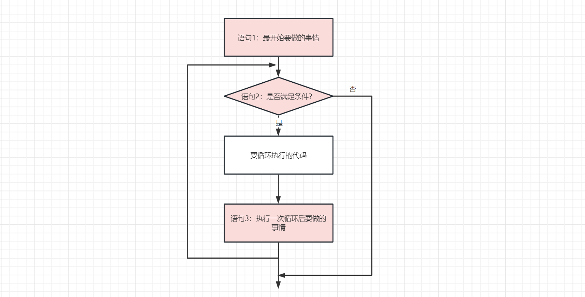
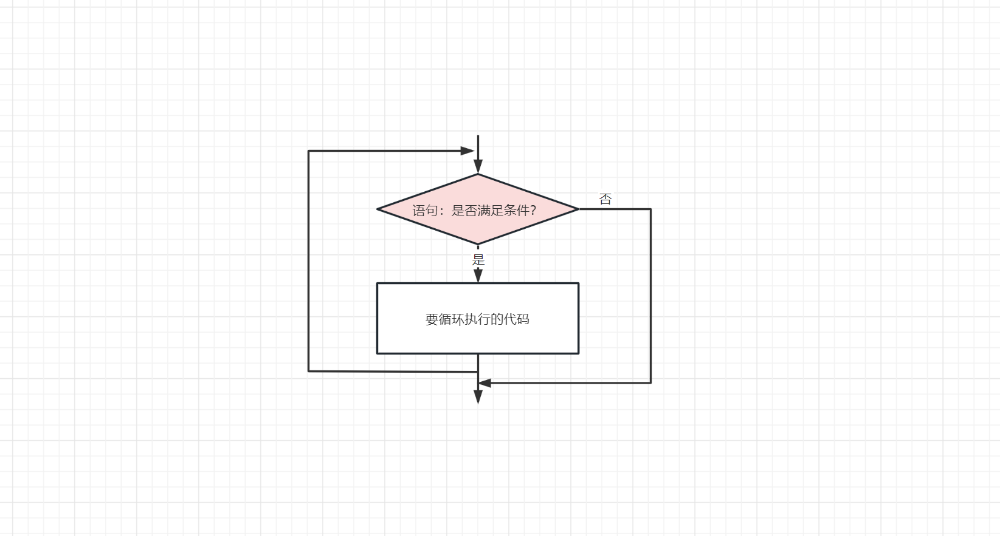

## 第四幕 循环往复的轨迹 I

在之前的学习中，我们已经理解了如何进行基本的输入输出和基本的运算。但是，我们并没有发挥出计算机的一个重要作用：快速重复执行大量任务。接下来，我们将学习如何在程序里构建判断和循环语句。

### 判断

作为最简单的函数，我们来一起创造一个求最大值的函数。这个函数名为`max`，接受两个int值`a`、`b`，返回他们的最大值。很显然，我们需要判断a和b哪个大。我们将情况分为3种：`a > b`、`a == b`（别忘了`a = b`的意思是把 b 的值给 a ！）、`a < b`。下面是一段代码：

```c
int max(int a, int b)
{
    if (a > b)          // 若满足 a > b 执行下面这个大括号的代码
    {
        return a;
    }
    else if (a = b)     // 若不满足上面的 a > b 且满足 a = b 执行下面这个大括号的代码
    {
        return a;
    }
    else                // 若上面的两种情况都不满足执行下面这个大括号的代码
    {
        return b;
    }
}
```

首先，**上面的代码是错误的**。你能找到这个错误吗？对，就是我们反复强调的`a = b`和`a == b`的区别！显然，这里写成赋值语句是错误的。

通过上面的例子我们确实可以很快理解if语句是怎么编写的。但是，这段代码还可以更短。因为当`a == b`的时候，返回a或者b都是可以的，为什么我们不把这种情况放在a < b的情况中呢？很快，我们得到了更短的代码：

```c
int max(int a, int b)
{
    if (a > b)
        return a;
    else
        return b;
}
```

通过这段代码，我们发现，`else if`并不一定出现在if语句里（其实else if也可以有多个）。那为什么大括号不见了呢？这是因为我们约定，**如果if语句的大括号里只有一个语句，那大括号是可以省略的。**

> [!question]
> **如果函数内只有一个语句，函数的大括号可以省略吗？**
>
> 为什么不去试试看呢？
>

这段代码还可以更短吗？还记得我们在第二幕里面讨论过return语句的用法吗？一旦执行到return语句，后面的代码将不再执行。那这段代码确实可以更短：

```c
int max(int a, int b)
{
    if (a > b)
        return a;
    return b;
}
```

我们发现，`else`也不一定出现在if语句里面。如果a > b，那返回a，这个函数的执行已经结束，不会执行到下面的`return b`；否则，返回b。

> [!hw]
> **if语句的本质：真与假，非0与0**
>
> 在上面，我们已经感性地认识了if语句。如果括号内的式子成立，那执行下面大括号内的代码。
>
> 但是，事实上，if的括号里还可以放一个单独的值。例如：
>
> ```c
> if (a)
>     printf("a != 0\n"); // != 表示不等于 
> ```
>
> 这是怎么回事呢？原来，if语句只是对括号内的值进行了求值。例如`a > b`，如果 a 真的大于 b 这个式子返回 1 ，否则返回 0 。if语句的本质只是对括号内部的式子进行求值，如果为0则不执行，否则执行。
>

我们还可能遇到一种情况：我们与客户约定了，某个值的取值对应了不同的结果。如果情况比较少，我们还可以使用多个else if 来编写程序。但是如果情况很多的话，这样写是十分费力的。下面介绍`switch`语句：

```c
int a;
printf("请输入一个数字，我会提供对应的服务：");
scanf("%d", &a);  // 是&a不是a！！！
switch(a)
{
    case 1:     // 这里是冒号不是分号！
        printf("按摩\n");
        break;  // 警告：每个case后面必须有break，否则会继续执行到下一个case。
    case 2:
        printf("唱歌\n");
        break;
    case 3:
        printf("跳舞\n");
        break;
    default:
        printf("我也不知道该做什么\n");
}
```

> [!hw]
> **计算机并不优雅：打印出来为什么全是乱码？**
>
> 你真的很细心！看来你亲自在VSCode上面测试了这段代码而不是只是看看教程，这很值得鼓励！
>
> 那下面，我们来向你介绍用来存储字符的`char`类型。
>
> ```c
> char a = 'a'; // 警告：是单引号不是双引号！！！
> printf("%c", a); // 输入输出时使用%c
> printf("%d", a); // 如果把a当作int类型打印，结果是多少？
> ```
>
> 刚开始计算机只需要处理英文字符，为此计算机科学家发明了`ANSII编码`（American Standard Code for Information Interchange）。它使用7位二进制数来表示每一个字符。所以，理所当然地，**`char`类型占用1个字节**。AISII码里面有哪些字符呢？请百度搜索一下，并找到字符`d`和`E`对应的ANSII码。
>
> 后来，随着计算机的进入各个国家，让计算机处理其他语言是必要的。为此，各国都开始在ANSII码的基础上扩展出自己的编码（为什么不是彻底重做而是在ANSII码的基础上扩展？）。其中，处理简体中文的编码被命名为`GBK`（不是英文缩写，是“国标扩”的首字母）作为内地的标准。英文字符占用1个字节，中文字符占用2个字节。
>
> 虽然我们有了各种编码，但还有一个问题——各国创造的这些编码是互相不兼容的。这意味着使用一种编码编写的文档，使用另一种编码打开会全是乱码。那为什么不创造一种能表示全世界所有语言的大一统的编码呢？这确实是个美好的想法，最终这个想法成功变为了现实——Unicode编码。其中最流行的Unicode实现叫做UTF-8编码，我们现在主要使用这种编码。（UTF-8这类变长字符集的具体实现也有一些巧思，请百度进一步了解。）
>
> 所以刚才为什么会乱码呢？是因为我们的代码文件使用UTF-8编码来存储，而Windows控制台默认使用GBK编码，这样我们的中文显示就会乱码。为了解决这个问题，请在项目的`.vscode`文件夹里面的`tasks.json`里进行一些修改：
>
> 在第十二行的最后加上英文逗号，然后回车，在下一行输入`"-fexec-charset=GBK"`。
>

&emsp;

> [!question]
> **课外知识：为什么switch的语法如此奇怪？**
>
> 艾拉觉得switch的语法很奇怪，她觉得switch语句这么写会更加好看,也更符合C语言的特色：
>
> ```c
> switch(a)
> 1
>     printf("a=1");
> 2
>     printf("a=2");
> else
>     printf("strange answer.");
> ```
>
> 乍一看这样的写法确实更加简洁，那为什么C语言没有这样设计，反而case后面还非要加个冒号，情况结束还非要加一个 `break;`呢？
>
> 相信你之前已经意识到，即使C语言代码对普通的人类来说已经不好理解了，只会算术的计算机应该也没有办法辨认这些英文字母。事实上，编译器gcc需要将你编写的C语言代码转换成计算机可以理解的二进制指令。这些指令里没有数据类型，也没有循环结构，只有加减乘除，移位，跳转等等傻乎乎的计算机能理解的工作。
>
> 在没有C语言的日子里，最初先驱们每写一行代码都要去翻厚厚的手册查一下对应的数字指令——这简直是太难以忍受了！于是，他们发明了汇编语言，用英文字母代替这些傻乎乎的数字，然后让一个程序把字母转化成数字——这确实是个伟大的发明，虽然汇编语言还是没有数据类型，没有循环结构。
>
> 事实上，先驱们准备的这些基础设施至今仍在发挥作用。你可以使用`gcc -S test.c`命令将test.c编译为汇编语言程序。
> 
> 下面，我们展示一段C语言程序及其对应的汇编语言程序：
> ```c
> int main(void)
> {
>     int a = 2;
>     int b;
>     switch(a + 1)
>     {
>         case 2:
>             b = 1;
>             break;
>         case 3:
>             b = 2;
>             break;
>         default:
>             b = 3;
>     }
>     return 0;
> }
> ```
> 
> ```asm
>   ...
> 	movl	$2, 12(%esp)
> 	movl	12(%esp), %eax
> 	addl	$1, %eax
> 	cmpl	$2, %eax
> 	je	L2
> 	cmpl	$3, %eax
> 	je	L3
> 	jmp	L7
> L2:
> 	movl	$1, 8(%esp)
> 	jmp	L5
> L3:
> 	movl	$2, 8(%esp)
> 	jmp	L5
> L7:
> 	movl	$3, 8(%esp)
> L5:
> 	movl	$0, %eax
>   ...
> ```
>
> 即使你看不懂汇编语言程序，但是如果我提醒你cmpl是将第一个数和第二个数作比较，je和jmp是跳转指令，你应该可以感受到C语言程序和汇编语言的代码结构有一种相似的感觉——每一个case对应了汇编语言的标签`L2`、`L3`、`L7`，如果你删去一个`break;`，对应的`jmp L5`也会消失！
>
> 这就是为什么switch语句这么奇怪——因为C语言是在具体的历史中诞生的，C语言的代码是可以很好地与汇编语言代码对应的。既然C语言如此贴近汇编语言，那C语言也就和计算机硬件心连心。事实上，linux 0.11操作系统除了必要的一小部分操作，其他代码全部使用C语言编写。操作系统这样的庞然大物，也不过是个C语言程序，不知道这个消息能不能让你对C语言和自己正在进行的C语言学习有一种骄傲感。

### 循环

下面，我们来编写一个更复杂的函数：计算斐波那契数。

```c
int main(void)
{
    int num;
    scanf("%d", &num);
    if (num == 0 || num == 1)  // "||"表示或，两者有一个为1即为1；"&&"表示与，两者均为1才为1；"!"加在表达式前面表示非，非0则变成0，0则变成1。
    {
        printf("%d\n", num);
    }
    else
    {
        int num0 = 0, num1 = 1;
        for (int i = 1; i < num; i++)
        {
            int new_num1 = num0 + num1;
            num0 = num1;
            num1 = new_num1;
        }
        printf("%d\n", num1);
    }
    return 0;
}
```

上面的代码使用了`for`循环。它的语义如下：
```c
for (最开始要做的事情; 满足这个条件就不退出for循环; 执行一次循环后要做的事情)
{
    // 要循环执行的代码
}
```

具体的流程图**非常重要**，如下图所示：



很显然，上面的代码就是刚进入for循环定义一个变量叫做i，赋值为0，然后计算新的`num1`和`num0`，顺便`i++`，直到`i >= num`为止。

那如果不使用for循环的话，我们可以使用while循环：

```c
while (满足这个条件就不退出while循环)
{
    // 要循环执行的代码
}
```



&emsp;

好了，这下我们有了构建一切程序的最基本的工具：函数、判断和循环。我们可以着手写程序了。

> [!note]
> 第四幕到此结束。奖励30原石。